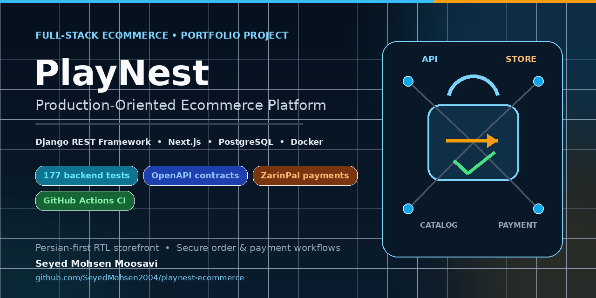
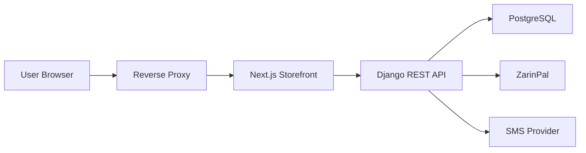

<p align="center">
  
</p>

<h1 align="center">PlayNest</h1>

<p align="center">
  A production-oriented ecommerce platform powered by Django REST Framework
  and a Persian-first Next.js storefront.
</p>

<p align="center">
  <a href="https://github.com/SeyedMohsen2004/playnest-ecommerce/actions/workflows/ci.yml">
    
  </a>
  
  
  
  
  
</p>

<p align="center">
  <a href="https://ipaktoys.ir"><strong>Live production deployment</strong></a>
  ·
  <a href="docs/architecture.md">Architecture</a>
  ·
  <a href="docs/deployment.md">Deployment guide</a>
  ·
  <a href="#api-documentation">API documentation</a>
</p>

PlayNest is a production-oriented ecommerce platform built as a Django REST
Framework API and a Persian-first, right-to-left Next.js storefront. The
engineering work covers catalog management, JWT authentication, cart and
checkout, order and payment state, inventory safeguards, shipping and coupon
pricing, OpenAPI contracts, automated testing, continuous integration, and
opt-in production containers.

## At a Glance

| Area | Details |
| --- | --- |
| Engineering role | Independent backend and full-stack development |
| Backend | Django REST Framework |
| Frontend | Next.js, React, TypeScript |
| Database | PostgreSQL |
| Payments | ZarinPal |
| Testing | 177 backend tests and 76.94% branch-aware coverage |
| Delivery | Docker, Gunicorn, Next.js standalone, GitHub Actions |
| Live deployment | [IpakToys online store](https://ipaktoys.ir) |

## Engineering Ownership

Designed and implemented independently by Seyed Mohsen Moosavi, covering
backend architecture, REST APIs, database design, payment integration,
deployment infrastructure, automated testing, CI, and frontend integration.

## Key Engineering Highlights

- Transactional ZarinPal payment request and callback processing with
  server-side verification, row locking, safe public responses, and repeated
  callback safeguards.
- Stock reduction only after verified payment, with idempotency markers and
  manual-review handling when paid orders cannot be finalized safely.
- Snapshot-based order totals covering product pricing, percentage or fixed
  coupons, configurable shipping zones, and coupon usage limits.
- Explicit order and payment state machines that separate checkout, payment
  verification, fulfilment, failure, cancellation, and review states.
- Versioned OpenAPI contracts generated by drf-spectacular with no remaining
  W001 or W002 schema warnings.
- 177 backend tests with branch-aware coverage and a 76% CI regression gate.
- Separate development and opt-in production Compose workflows, including
  Gunicorn and Next.js standalone images running as non-root users.

## Live Production Project

A production deployment of PlayNest powers the
[IpakToys online store](https://ipaktoys.ir). This public repository demonstrates
the engineering implementation and is not claimed to be byte-for-byte identical
to the live environment. GitHub changes are not automatically deployed.

Production credentials, customer data, commercial datasets, private operational
details, and infrastructure-specific configuration are excluded. Engineering
attribution applies only to the software implementation, not to store ownership,
client branding, product data, customer data, or commercial operations.

## Main Features

- Persian-first, responsive RTL storefront built with the Next.js App Router.
- Product catalog with categories, brands, images, search, filtering, sorting,
  homepage merchandising, wishlist, ratings, and reviews.
- Phone-number and password registration and login with JWT access and refresh
  tokens.
- Authenticated cart, coupon preview, shipping-rate calculation, checkout, and
  customer-owned order history.
- Order lifecycle management for pending, failed-payment, paid, processing,
  shipped, delivered, and cancelled states.
- Real ZarinPal request, browser callback, server-side verification, and
  storefront redirect flow; sandbox mode is available for development.
- Configurable Kavenegar and console SMS adapters. The current registration
  endpoint activates the account immediately and does not send an OTP; the OTP
  model, delivery service, and legacy verification endpoint are retained but
  are not the active registration flow.
- Administrative workflows for users, products, orders, payments, shipping,
  coupons, homepage slots, reviews, and inventory.
- Local development seed data and a guarded Excel/image product-import command.
- Swagger UI, machine-readable OpenAPI schema, and a public health endpoint.

## Architecture

The browser-facing Next.js application consumes versioned Django REST
endpoints. Django owns authentication, validation, pricing, transactional
checkout, order state, payment verification, and PostgreSQL persistence.
External payment and SMS providers are accessed only through backend services.



Development uses `docker-compose.yml` with PostgreSQL, Django `runserver`, and
the Next.js development server. Production assets are opt-in:
`docker-compose.prod.yml` uses PostgreSQL, Gunicorn, and the Next.js standalone
server with persistent database, static, and uploaded-media volumes. An
operator-managed reverse proxy is responsible for HTTPS, public routing, and
static/media delivery.

See [Architecture](docs/architecture.md) for component boundaries and lifecycle
details.

## Technology Stack

| Area | Technology |
| --- | --- |
| Backend | Python 3.12, Django 5.2, Django REST Framework 3.16 |
| Authentication | SimpleJWT |
| Database | PostgreSQL 16, psycopg 3 |
| API contracts | drf-spectacular / OpenAPI 3 |
| Frontend | Next.js 15, React 19, TypeScript, Tailwind CSS |
| Payments | ZarinPal |
| SMS integration | Kavenegar adapter and console development adapter |
| Containers | Docker, Docker Compose, Gunicorn, Next.js standalone output |
| Testing | pytest, pytest-django, pytest-cov, coverage.py |
| Quality and CI | Black, Flake8, ESLint, GitHub Actions |

## Repository Structure

| Path | Purpose |
| --- | --- |
| `backend/` | Django project, application packages, migrations, tests, and management commands. |
| `frontend/` | Next.js App Router storefront and typed API client. |
| `docs/architecture.md` | System boundaries, data flows, and deployment architecture. |
| `docs/deployment.md` | Opt-in manual production deployment and rollback runbook. |
| `docker-compose.yml` | Local development stack. |
| `docker-compose.prod.yml` | Separate production-oriented stack. |
| `.env.example` | Safe local-development environment template. |
| `.env.production.example` | Placeholder-only production environment template. |
| `SECURITY.md` | Responsible disclosure and security policy. |
| `CONTRIBUTING.md` | Contribution checks and review expectations. |
| `CHANGELOG.md` | Unreleased changes and prepared 1.0.0 notes. |

## Local Development

Docker Engine with Compose v2 is the simplest supported setup:

```bash
cp .env.example .env
docker compose up --build -d
docker compose exec api python manage.py migrate
docker compose exec api python manage.py check
```

Local endpoints:

| Service | URL |
| --- | --- |
| Frontend | `http://localhost:3000` |
| Backend health | `http://127.0.0.1:8000/api/v1/health/` |
| Swagger UI | `http://127.0.0.1:8000/api/v1/docs/` |

If port 3000 is unavailable, choose another host port without editing Compose:

```bash
FRONTEND_PORT=3001 docker compose up --build -d
```

The frontend still listens on port 3000 inside its container. Browser requests
use the public development API URL configured through
`NEXT_PUBLIC_API_BASE_URL`, not the internal Compose service name.

### Development utilities

Create repeatable local demonstration data:

```bash
docker compose exec api python manage.py seed_data
```

Seed data is intended only for local development and is never loaded
automatically by the production images.

A guarded command is also available for importing local product workbooks and
images:

```bash
docker compose exec api python manage.py import_real_products
```

Imported datasets and generated media are gitignored. See
[Product Import Data](backend/import_data/README.md) for the expected structure,
safety requirements, and import workflow.

## Environment Configuration

Use the tracked templates for local and production configuration:

- `.env.example` for the local Django, PostgreSQL, and provider settings.
- `frontend/.env.example` for the browser-visible API base URL.
- `.env.production.example` for placeholder-only production values.

Never commit generated `.env` files or runtime secrets.
`NEXT_PUBLIC_API_BASE_URL` is embedded into the frontend bundle, while Django
keys, database credentials, SMS credentials, and payment merchant identifiers
must remain private.

## API Documentation

With the development stack running:

| Resource | URL |
| --- | --- |
| Swagger UI | `http://127.0.0.1:8000/api/v1/docs/` |
| OpenAPI schema | `http://127.0.0.1:8000/api/v1/schema/` |
| Health check | `http://127.0.0.1:8000/api/v1/health/` |

Validate the generated contract:

```bash
docker compose exec api python manage.py spectacular \
  --file /tmp/schema.yml --validate
```

Payment authority values, raw gateway responses, card hashes, private gateway
messages, and other internal payment fields are excluded from customer-facing
serializers and schema examples.

## Testing and Coverage

The verified baseline is 177 passing backend tests, 80.81% statement coverage,
55.90% branch coverage, and 76.94% combined branch-aware coverage. CI enforces
`--cov-fail-under=76` so a meaningful regression fails the backend job.

```bash
docker compose exec api pytest \
  --cov --cov-branch --cov-report=term-missing --cov-fail-under=76
docker compose exec api black --check .
docker compose exec api flake8 .

docker compose run --rm --no-deps frontend sh -c \
  "npm ci && npm run lint && npm run build"
```

GitHub Actions keeps three independent concerns visible:

- `backend`: PostgreSQL-backed Django checks, branch-aware tests and coverage,
  Black, and Flake8.
- `frontend`: reproducible npm installation, ESLint, and production build.
- `production-assets`: production Compose interpolation plus backend and
  frontend production-image builds with safe CI placeholders.

## Production Readiness

Production support is additive and manual. It uses separate multi-stage
Dockerfiles, non-root runtime users, named PostgreSQL/static/media volumes,
health checks, loopback-bound application ports, explicit migration and
`collectstatic` steps, and no automatic demo-data loading.

The workflow has not been confirmed as the topology used by the linked live
deployment. An operator must verify the real server, reverse proxy, storage,
backup, HTTPS, and rollback arrangements before adoption. See
[Production Deployment](docs/deployment.md).

## Security and Privacy

Production secrets belong in untracked environment or secret-management
systems. Real customer records, operational logs, merchant identifiers, SMS
credentials, private callbacks, backups, and infrastructure details must never
be committed. Uploaded media is persistent and must be treated as untrusted
content.

Permission to mention a production deployment is not permission to probe or
security-test it. See [Security Policy](SECURITY.md) for responsible disclosure.

## Documentation

- [Architecture](docs/architecture.md)
- [Production deployment](docs/deployment.md)
- [Documentation index](docs/README.md)
- [Product import data](backend/import_data/README.md)
- [Frontend notes](frontend/README.md)
- [Contributing](CONTRIBUTING.md)
- [Security policy](SECURITY.md)
- [Changelog](CHANGELOG.md)

## Project Status

The repository contains a tested ecommerce implementation with a documented
`v1.0.0` portfolio release baseline. Production deployment remains a manual
operator process; the public GitHub branch is not automatically promoted to the
live website.

## License

This repository is publicly visible for portfolio review and technical
evaluation. No open-source license is granted. All rights are reserved; no
permission to copy, modify, redistribute, sublicense, or use the code
commercially should be inferred from its public availability.

## Author

**Seyed Mohsen Moosavi**

- GitHub: [SeyedMohsen2004](https://github.com/SeyedMohsen2004)
- LinkedIn: [seyed-mohsen-moosavi](https://www.linkedin.com/in/seyed-mohsen-moosavi-9b68ab2a7/)

Independent engineering attribution applies to the software implementation,
not to client branding, store ownership, commercial content, products, or
business operations.
