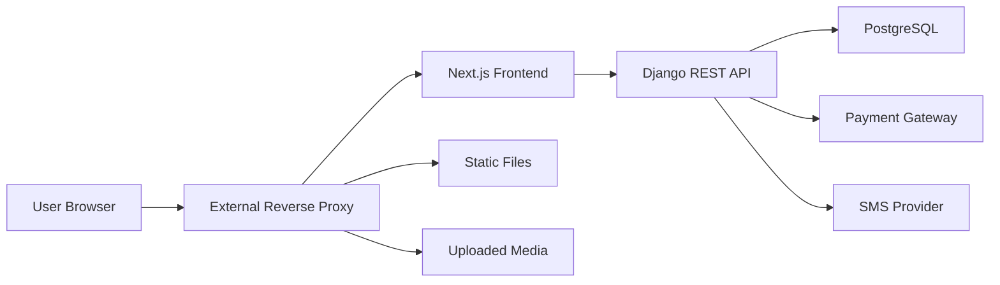

# PlayNest Architecture

## System Context

PlayNest separates the browser-facing storefront from the business and data
layer. Next.js renders the Persian RTL user experience and calls versioned
Django REST endpoints. Django owns authorization, validation, pricing,
transactional state transitions, payment verification, and persistence in
PostgreSQL.

External payment and SMS integrations are backend-only boundaries. A production
reverse proxy is responsible for HTTPS termination, public routing, and
static/uploaded-media delivery.



The diagram is intentionally generic. It does not describe private server
addresses, privileged routes, credentials, or the topology of any particular
deployment.

## Django Applications

| Application | Responsibility |
| --- | --- |
| `accounts` | Custom phone-number user model, JWT registration/login responses, profile API, and SMS/OTP support code. |
| `products` | Catalog, categories, brands, product images, homepage placement, filtering, wishlist, and reviews. |
| `orders` | Cart, checkout, order snapshots, coupons, shipping settings, ownership rules, and fulfilment state. |
| `payments` | ZarinPal requests, callback validation, server-side verification, safe public serialization, and payment finalization. |
| `core` | Health endpoint and local development seed command. |
| `config` | Django settings, URL routing, OpenAPI configuration, and WSGI/ASGI entry points. |

## Frontend and API Boundary

The Next.js frontend uses a public `NEXT_PUBLIC_API_BASE_URL` to reach the
versioned API. The value is compiled into the browser bundle, so changing it
requires a frontend rebuild. Secrets must never be placed in public frontend
variables.

The API is the authority for identities, cart contents, product availability,
discount validity, shipping fees, order totals, payment state, and ownership
checks. The frontend may format or present those values but must not be treated
as a trusted source for money or permission decisions.

## Authentication

Users register and log in with an Iranian mobile number and password. The
current registration endpoint creates an active, phone-verified account and
returns JWT access and refresh tokens immediately. Login also returns JWTs, and
authenticated endpoints use SimpleJWT.

The codebase includes an OTP model, Kavenegar/console delivery adapters, and a
registration-verification endpoint. No OTP is created or sent by the active
registration endpoint, so documentation and clients must not claim that OTP is
currently required. Activating OTP in the future would be an authentication
behavior change requiring dedicated security review and tests.

## Cart and Checkout

Cart endpoints are authenticated and scoped to the requesting user. Line-item
quantity validation checks product activity and available stock. Checkout locks
the cart and relevant products, revalidates availability, calculates price
snapshots, and creates an order with immutable item names, quantities, and unit
prices.

Checkout does not reduce inventory. This avoids reserving stock for orders that
have not completed payment, while payment request and callback paths perform
additional stock checks to handle changes between checkout and verification.

## Order Lifecycle

Orders use explicit states:

```text
pending -----------------------> paid -> processing -> shipped -> delivered
   |                              ^
   +-> payment_failed ------------+
   |
   +-> cancelled

payment_failed -> cancelled
```

The actual transition rules remain enforced by serializers, services, and admin
workflows. `stock_reduced` records whether inventory finalization happened.
`requires_manual_review` and its reason preserve paid-but-inconsistent cases for
operator action instead of silently forcing an unsafe state.

## Payment Request and Callback Lifecycle

1. An authenticated customer requests payment for an order they own. Staff
   access follows explicit permission rules.
2. The API checks that the order is payable and revalidates stock.
3. A pending payment is created or reused under a uniqueness constraint.
4. The backend requests a payment from ZarinPal using the server-held merchant
   configuration and returns a customer-safe payment URL.
5. ZarinPal redirects the browser to the public callback with an opaque
   authority and callback status.
6. The backend validates callback inputs, loads the stored payment, and verifies
   the stored authority and amount with ZarinPal.
7. A verified payment is finalized transactionally and the browser receives an
   HTTP redirect to a safe frontend success or failure page.

The public payment serializer excludes authority values, card hashes, raw
gateway responses, private gateway messages, and internal verification fields.
The legacy manual verification endpoint returns HTTP 410 and cannot mark a
payment as paid.

## Callback Idempotency and Stock Safeguards

Payment and order rows are locked during finalization. A fully finalized payment
short-circuits repeated callbacks, and the order/payment markers prevent stock,
coupon usage, and cart cleanup from being applied twice.

After verified payment, inventory is reduced under product locks. If stock is no
longer sufficient, the payment remains recorded while the order is flagged for
manual review; inventory and cart data are not falsely finalized. Cancelled or
already-fulfilling orders are protected from unsafe downgrades or repeated stock
changes.

## Coupons and Shipping

Coupons support percentage and fixed discounts, optional minimum order values,
maximum discount caps, activation windows, and usage limits. Validation and
discount calculations run on the backend. Coupon usage increments during
successful, idempotent payment finalization.

Shipping uses backend-managed fees for two shipping zones. Checkout stores the
selected zone and shipping-cost snapshot on the order so later configuration
changes do not rewrite historical totals.

## Development Architecture

`docker-compose.yml` is the local workflow:

- PostgreSQL 16 stores development data in a named volume.
- Django runs with `runserver`, source bind mounts, and local media persistence.
- Next.js runs its development server with source, dependency, and build-cache
  mounts.
- The frontend host port is configurable through `FRONTEND_PORT`; internal
  service ports remain stable.

Development defaults and console integrations are intentionally convenient and
must not be treated as production configuration.

## Opt-in Production Architecture

`docker-compose.prod.yml` is a separate, manually adopted workflow:

- PostgreSQL has a persistent named volume and no published host port.
- Django is built from `backend/Dockerfile.prod`, runs under Gunicorn as UID/GID
  10001, and uses named static and media volumes.
- Next.js is built from `frontend/Dockerfile.prod`, copies standalone server
  traces and static/public assets, and runs as UID/GID 10001.
- Application ports bind to loopback by default for an external reverse proxy.
- Health checks cover PostgreSQL readiness, the API health endpoint, and the
  frontend production server.
- There are no source bind mounts, development commands, automatic migrations,
  or automatic seed imports.

Migrations, `collectstatic`, backups, health verification, and rollback are
explicit operator steps described in
[the deployment runbook](deployment.md). The existence of this stack does not
mean it has been adopted by any current production server.

## Static Files and Uploaded Media

Django static files are collected explicitly into a persistent static volume.
Uploaded media uses a separate persistent volume or an operator-approved
external store; it must never depend on an ephemeral application layer.

The external reverse proxy must safely serve or proxy static and media content.
User uploads are untrusted: they require conservative content types, no
execution, suitable size limits, and preferably origin isolation. Django does
not serve uploaded media when `DEBUG=False`.

## Reverse Proxy Responsibility

The production reverse proxy is responsible for:

- TLS certificates, HTTP-to-HTTPS redirects, and public routing.
- Forwarding frontend and API traffic to loopback-bound services.
- Serving or proxying static and uploaded media safely.
- Applying operator-approved request-size, timeout, rate, and logging policies.
- Removing client-supplied forwarding headers and setting trusted values itself.

Django may trust `X-Forwarded-Proto` only when
`DJANGO_TRUST_X_FORWARDED_PROTO=True` and the proxy strips and replaces that
header. Real proxy behavior must be confirmed before enabling SSL redirects or
long-lived HSTS.
